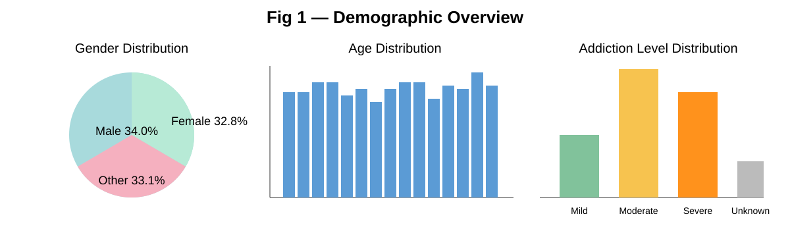
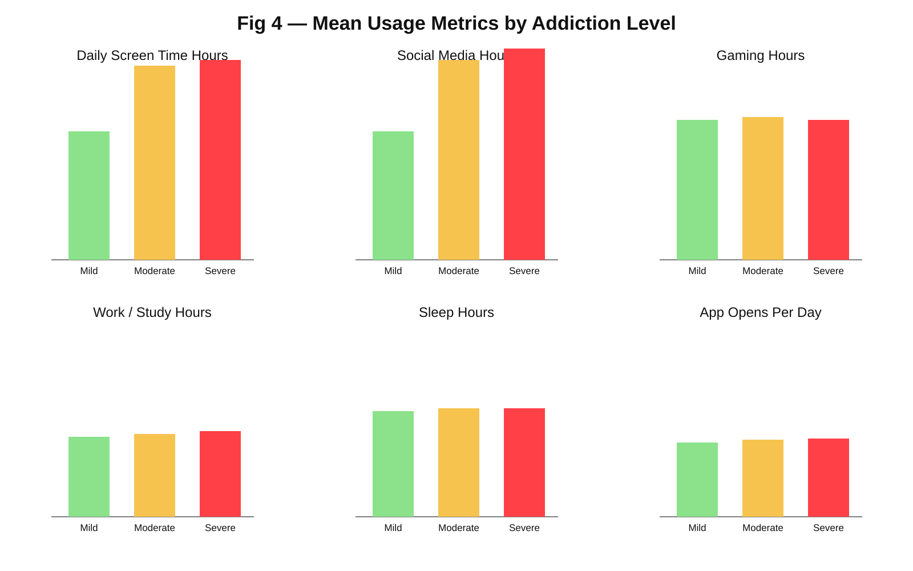
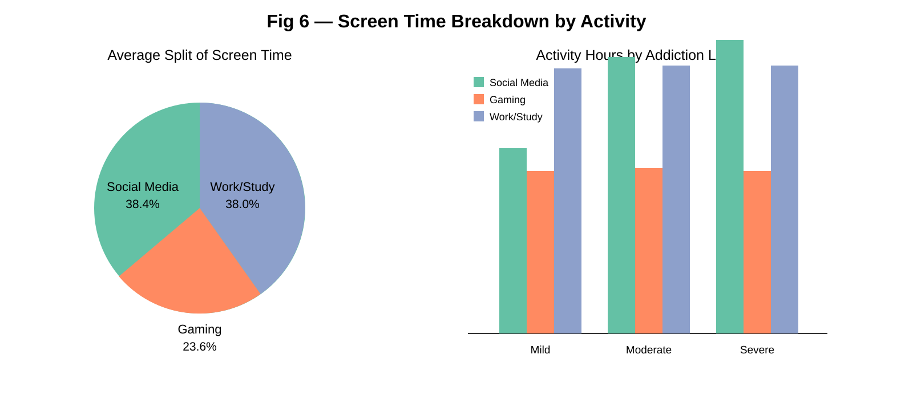

<div align="center">

# 📱 Smartphone Usage Patterns

**Exploratory data analysis of smartphone usage, digital habits, addiction, stress, and academic impact.**


</div>

---

## 📊 Overview

This project analyzes a **7,500-record smartphone usage dataset** to explore how everyday smartphone behavior relates to addiction levels, stress, sleep, and academic/work impact.

The analysis combines data cleaning, descriptive statistics, correlation and covariance analysis, outlier detection, group comparisons, and visualizations to identify meaningful usage patterns.

## 🔎 What This Project Covers

- Dataset inspection — shape, data types, missing values, and duplicates
- Data cleaning and preparation
- Demographic and usage-pattern exploration
- Covariance and correlation analysis across numerical features
- Outlier detection using **IQR** and **Z-score** methods
- Comparison of usage patterns across addiction levels
- Weekday vs. weekend screen-time analysis
- Screen-time breakdown across major activities
- Relationships between smartphone usage, stress, sleep, and academic/work impact

## 📈 Visualizations

### Demographic Overview



### Usage Metrics by Addiction Level



### Screen Time Breakdown



## 🛠️ Tech Stack

- **Python** — Core programming language
- **Pandas** — Data loading, cleaning, manipulation, and analysis
- **NumPy** — Numerical and statistical computations
- **Matplotlib** — Data visualization

## 🚀 How to Run

```bash
# 1. Clone the repo
git clone https://github.com/Lakshay-M07/smartphone-usage-patterns.git
cd smartphone-usage-patterns

# 2. Install dependencies
pip install pandas numpy matplotlib

# 3. Place the dataset in the same folder
# (Smartphone_Usage_And_Addiction_Analysis_7500_Rows.csv)

# 4. Run the script
python 1025250224_smartphone_analysis.py
```

## 📌 Key Findings

- Higher smartphone screen time is associated with stronger addiction patterns.
- Social media represents a significant component of overall smartphone usage.
- Sleep duration tends to decrease as usage intensity increases.
- Weekend screen time is generally higher than weekday screen time, with a mean difference of about **1.74 hours** in this dataset.
- Heavy users can be identified through unusually high notification counts and app-opening frequency.
- Usage patterns vary across different addiction levels, providing useful behavioral comparisons.

> **Important:** These findings describe patterns and associations in the dataset; correlation does not establish causation.

## ⚠️ Limitations

- The analysis is based on a finite sample of **7,500 records**.
- The dataset does not provide a time-series dimension, so year-by-year trends cannot be studied.
- Self-reported behavioral data may contain reporting bias.
- Important contextual variables such as location, company size, and detailed skill sets may not be available.
- Correlation and covariance indicate relationships between variables, not causal effects.

---

<div align="center">

### 📱 Understanding Digital Habits Through Data

</div>
